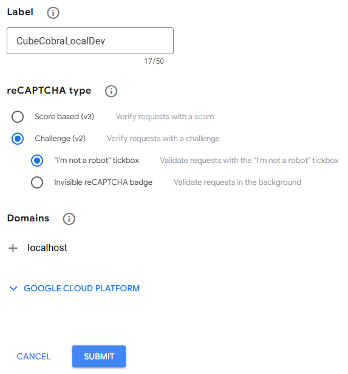

# CubeCobra

An open source web application for building, managing, and playtesting Magic: the Gathering cubes.

### Contributing

If you are interested in contributing towards Cube Cobra, please read the [Contribution guidelines for this project](CONTRIBUTING.md).

# Setup

## Common

### Install Prerequisites

### Code Editor (IDE)

VSCode (strongly recommended, but not required): https://code.visualstudio.com/
ESLint Extension for VSCode: https://marketplace.visualstudio.com/items?itemName=dbaeumer.vscode-eslint
Prettier Extension for VSCode: https://marketplace.visualstudio.com/items?itemName=esbenp.prettier-vscode

VSCode (with the ESLint and Prettier extension) is the recommended environment. When using this setup, make sure that your selected workspace is the root folder that you have cloned, this will ensure that the ESLint plugin can work with our linting rules. Prettier will automatically apply standard formatting to your code. Using these plugins will make adhering to the linting and code formatting rules significantly easier.

### AWSLocal CLI (for Localstack)

The awslocal CLI used by this project (https://github.com/localstack/awscli-local) is required for initial setup of the localstack resources used by Cube Cobra.

First install Python (suggest Python 3) and pip for your operating system. Sample instructions for a linux environment are:

- Ensure Virtual environment package is installed: `sudo apt-get install python3-venv`
- Create a virtual environment in your home directory: `python3 -m venv ~/venv`
- Add the virtual environment to your path: `export PATH=~/venv/bin:$PATH`
- Also add to your startup profile script (eg. bash profile) the activation of the virtual environment: `source ~/venv/bin/activate`
- Install awslocal: `pip3 install "awscli-local[ver1]"`
- Validate install: `awslocal --version`
  - Will pass and print some "aws-cli" version (likely 1.X) for the system

### reCAPTCHA account

To combat spam CubeCobra uses Google reCAPTCHA (V2) in actions such as creating cubes. Thus in order to use the site locally you must have a reCAPTCHA account, which thankfully are free (no credit card needed) with 10,000 assertions a month. To setup the account follow these steps:

1. Go to https://www.google.com/recaptcha/admin/create
2. Enter any label you wish (suggest CubeCobraLocalDev)
3. Set "reCAPTCHA type" to V2, with "I'm not a robot" tickbox enabled
4. Enter "localhost" as the domain
5. If you have setup your local CubeCobra to be accessible under a non-localhost domain (see [Running CubeCobra](#running-cubecobra)) then include that domain as well
6. Close the "Google Cloud Platform" section, as GCP is not required
7. Save. See screenshot as an example of the desired settings:
   
8. The generated "Site key" and "Secret key" values will be shown (You can always get these again from the reCAPTCHA settings if necessary
9. Run `cp .env_EXAMPLE .env` to create a .env file with values for running the application locally already set
10. Edit the .env file
11. Paste the value of the "Site key" as the value of the CAPTCHA_SITE_KEY environment variable
12. Paste the value of the "Secret key" as the value of the CAPTCHA_SECRET_KEY environment variable
13. Save the .env file changes

### Installing docker

Docker Desktop: https://docs.docker.com/desktop/

With Windows + WSL2, also: https://docs.docker.com/desktop/features/wsl/

### jq (Optional)

jq (https://jqlang.org/) is a very useful tool when dealing with JSON data, of which CubeCobra's card catalogs are all stored in.

Download and install from https://jqlang.org/download/

## Running CubeCobra in Docker

Running CubeCobra within docker is the simplest and faster way to get everything up and running. For Windows users we highly recommend running docker
using [Windows Subsystem for Linux 2 (WSL2)](https://learn.microsoft.com/en-us/windows/wsl/install) with Ubuntu (22.04 or above).

### Initial Setup

For the first setup, you will need to run:

```sh
docker compose -f docker-compose.yml -f ./docker/init.yml up --abort-on-container-exit
```

Note: This can take tens of minutes to complete.

This will:

- setup localstack w/ s3 bucket and email verified
- install dependencies
- build the application code to run setup scripts
- run setup scripts to:
  - setup local files for application perisistence
  - setup localstack dynamodb tables (ex. Users, Cubes, Cards, etc.)
  - download bulk card data from scryfall, persist to files and load it to localstack s3

Once the setup is complete the containers will exit gracefully. The various card databases will be both within the private/ folder but also uploaded
to the localstack instance in docker.

### Running CubeCobra

Then you can start the program like so:

```sh
docker compose up
```

This script will:

- ensure nearly parsers for card filters have compiled
- compile & watch scss (bootstrap) styles
- compile & watch server javascript w/ nodemon
- run & watch webpack dev server

You can now open up a browser and connect to the app through: http://localhost:8080.

(Despite the fact that node says it is running on port 5000 in the logs, you should use port 8080 to connect because that is what webpack dev server is listening on.)

Nodemon will restart the application anytime there is a change to a source file (server files).

### Register an account

After accessing the application locally you will need to create a new user account using the "Register" link on the nav bar.

After doing so, run `bash scripts/extract-registration-email.sh` to print the registeration URL you would have been emailed. Copy it and/or
open via your terminal to complete registration, then you can login using the username and password you registered with.

## Running CubeCobra via node

You will need to install NodeJS and Localstack, and the complete the initial setup steps. You can find the necessary resources here:

### NodeJS

Node 20

NodeJS: https://nodejs.org/en/download/

### Localstack

[Localstack][https://www.localstack.cloud/] provides a local emulation of AWS Services required to run CubeCobra including S3, DynamoDB, Simple Email Service, and Cloudwatch.

- Windows: Download and install the binary from localstack
- Mac: `brew install localstack/tap/localstack-cli`
- Linux: Use the `curl` command from localstack

You may follow the installation guidelines from the localstack site. The recommended setup involves running localstack in a docker container, which requires [Docker Desktop](#installing-docker) as well.

Once localstack is installed, you can start the server in the background with the CLI: `localstack start --detached`. You can see the status with `localstack status`.

_Note_: Localstack community edition (eg. without a pro account) does not persist anything to disk once the container is stopped.

### Initial Setup

For the first setup, you will need to run:

```sh
npm install && npm run build
npm run setup:local
```

Note: This can take tens of minutes to complete.

This will:

- install dependencies
- build the application code to run setup scripts
- run setup scripts to:
  - create a .env file with values for running the application locally already set
  - setup localstack w/ s3 bucket
  - setup local files for application perisistence
  - setup localstack dynamodb tables (ex. Users, Cubes, Cards, etc.)
  - download bulk card data from scryfall, persist to files and load it to localstack s3

If you are on Windows, you will need to set bash as your script shell:

You will need to make sure you have `bash` installed somewhere and run the following command [with your `bash` path in place of the path below].

```sh
npm config set script-shell "C:\\Program Files\\git\\bin\\bash.exe"
```

### Running CubeCobra

Then you can start the program like so:

```sh
npm run start:dev
```

This script will:

- ensure localstack is running
- ensure nearly parsers for card filters have compiled
- compile & watch scss (bootstrap) styles
- compile & watch server javascript w/ nodemon
- run & watch webpack dev server

You can now open up a browser and connect to the app through: http://localhost:8080.

(Despite the fact that node says it is running on port 5000 in the logs, you should use port 8080 to connect.)

Nodemon will restart the application anytime there is a change to a source file.

Now complete the [registration process](#register-an-account) to create an account.

## Additional configurations and information

### Environment Variables & Connecting to AWS

Environment variables are populated from the `.env` file. There is no `.env` file checked in, so the setup script copies `.env_EXAMPLE` to `.env` and with some default values to support CubeCobra backed by LocalStack. The `.env_EXAMPLE` file is also loaded in the context of the Jest tests.

You can run a local instance of Cube Cobra against real AWS resources rather than LocalStack, if desired. After setting up S3, DynamoDB, and Cloudwatch using your AWS account, you can insert your credentials into the `.env` file.

Here is a table on how to fill out the env vars:

| Variable Name         | Description                                                                                                  | Required? |
| --------------------- | ------------------------------------------------------------------------------------------------------------ | --------- |
| AWS_ACCESS_KEY_ID     | The AWS access key for your account.                                                                         | Yes       |
| AWS_ENDPOINT          | The base endpoint to use for AWS. Used to point to localstack rather than hosted AWS.                        |           |
| AWS_LOG_GROUP         | The name of the AWS CloudWatch log group to use.                                                             | Yes       |
| AWS_LOG_STREAM        | The name of the AWS CloudWatch log stream to use.                                                            |           |
| AWS_REGION            | The AWS region to use (default: us-east-2).                                                                  | Yes       |
| AWS_SECRET_ACCESS_KEY | The AWS secret access key for your account.                                                                  | Yes       |
| CUBECOBRA_VERSION     | The version of Cube Cobra.                                                                                   |           |
| DATA_BUCKET           | The name of the AWS S3 bucket to use. You will need to create this bucket in your account.                   | Yes       |
| DOMAIN                | The domain name of the server. Used for external redirects such as emails.                                   | Yes       |
| DOWNTIME_ACTIVE       | Whether or not the site is in downtime mode.                                                                 |           |
| DYNAMO_PREFIX         | The prefix to use for DynamoDB tables. You can leave this as the default value                               | Yes       |
| LOCALSTACK_SES        | Set to "true" to still send emails via SES outside production. Assumes you have localstack running to catch. | Yes       |
| ENV                   | The environment to run Cube Cobra in.                                                                        | Yes       |
| NITROPAY_ENABLED      | Whether or not to enable NitroPay, our ad provider.                                                          |           |
| NODE_ENV              | The environment to run Cube Cobra in.                                                                        | Yes       |
| PATREON_CLIENT_ID     | The client ID for the Patreon OAuth app.                                                                     |           |
| PATREON_CLIENT_SECRET | The client secret for the Patreon OAuth app.                                                                 |           |
| PATREON_HOOK_SECRET   | The secret for the Patreon webhook.                                                                          |           |
| PATREON_REDIRECT      | The redirect URL for the Patreon OAuth app.                                                                  |           |
| PORT                  | The port to run Cube Cobra on.                                                                               | Yes       |
| SESSION_SECRET        | A secret phrase for session encryption. You can leave the default value.                                     | Yes       |
| SESSION               | The name of the session cookie. You can leave the default value.                                             | Yes       |
| CAPTCHA_SITE_KEY      | The reCAPTCHA site key                                                                                       | Yes       |
| CAPTCHA_SECRET_KEY    | The reCAPTCHA secret key                                                                                     | Yes       |
| DRAFTMANCER_API_KEY   | The Draftmancer API key                                                                                      | Yes       |
| HTTP_ONLY             | Default is unset. If set to exactly "true", generate http:// instead of https:// links                       | No        |
| STRIPE_SECRET_KEY     | Stripe secret key. Must have a value                                                                         | Yes       |

### Using Localstack emails

Reference: https://docs.localstack.cloud/aws/services/ses/#retrieve-sent-emails

If you have set `LOCALSTACK_SES="true"` (true by default) in your .env file and you are NOT using the [docker](#running-cubecobra-in-docker) setp, then you also need to manually verify that email for SES to work. Run:

```
awslocal ses verify-email-identity --email 'support@cubecobra.com'
```

Once verified, you can fetch them from localstack with:

```
curl --silent 'localhost.localstack.cloud:4566/_aws/ses?email=support@cubecobra.com' | jq .
```

Sadly it's not obvious how to take the RawData HTML to see in the browser.

### Updating Card Definitions and Analytics

In the initial setup scripts, `npm run update-cards` is what creates the card definitions. Running this script will pull the latest data from scryfall.

If you want card analytics, can run the following script:

```sh
npm run update-all
```

This will, in sequence:

- update draft history
- update cube history
- update metadata dictionary
- update cards

### Using bot predictions in drafts

The models CubeCobra uses can only be downloaded from Production with the support of the maintainers. Connect with the contributors on Discord.

# Concepts

More documentation on specific areas is found within the [docs](./docs) sub-folder.

## Backend

### API & Template Rendering

[Express 4][express] provides a minimalist web framework to support both template rendering with [PugJS 3][pug] and definition of JSON-based API endpoints. HTML templates are mainly used to render a minimal page for React to bootstrap itself into with initial props injected from the server.

[express]: https://expressjs.com/en/4x/api.html
[pug]: https://pugjs.org/api/getting-started.html

### Cards

We keep all card definitions in large pre-processed files, so that nodes in production just need to download and load the files, and can fetch the latest files from S3 when they're ready. We do this because it's much faster to read from memory than to have to make requests to some other service anytime we need card data.

An external process is responsible for updating the card definitions, and uploading to S3. This same process is also responsible for updating the card analytics, and data exports.

### Scheduled jobs

Each instance of the express server runs a job using node-schedule on a nightly basis to update the in-memory carddb from s3.

Bash scripts (`jobs/definition`) are executed periodically on AWS to run hourly, daily & weekly jobs.

### Card Filters

Card filters are defined that can be used by the frontend and backend. [Nearley][nearly] is a nodejs parser toolkit that is used to generate code that define filters that can be applied to the card database.

[nearly]: https://nearley.js.org/

## Frontend

### Typescript

[TypeScript 5.8][typescript] is gradually being rolled out to replace usage of vanilla JS components with PropTypes.

[typescript]: https://www.typescriptlang.org/docs/handbook/release-notes/typescript-5-5.html

### Components & Styling

Components are styled using TailwindCSS, with some custom CSS for more complex components.
