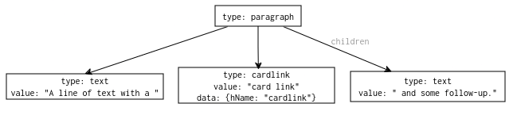

# Markdown Parser

Markdown parsing on Cube Cobra is done using the [react-markdown](https://github.com/remarkjs/react-markdown) component, which utilizes the [remark](https://github.com/remarkjs/remark) parser for Markdown. This document describes some of the inner workings of those tools and explains how our custom Markdown plugins interact with them.

## Parsing Overview

The high-level view of the parsing process can be described using the following diagram:

As can be seen above, the algorithm operates in several consecutive phases.

1. The backend parser ([micromark](https://github.com/micromark/micromark/)) goes through the input stream and converts it into a stream of "events".
2. The event stream is turned into a Markdown AST ([mdast-util-from-markdown](https://github.com/syntax-tree/mdast-util-from-markdown)). The creator takes in the input stream and the list of events, goes through each event in order, and constructs an AST describing the structure of the parsed input and the contents of each node in it.
3. (Optional) Transformations specified by plugins are performed on the AST ([remark](https://github.com/remarkjs/remark) plugins).
4. The Markdown AST is converted into an HTML AST ([remark-rehype](https://github.com/remarkjs/remark-rehype)).
5. (Optional) Transformations specified by plugins are executed on the HTML AST ([rehype](https://github.com/rehypejs/rehype) plugins).
6. The resulting HTML AST is converted into React components and rendered.

Our plugins mainly operate during the first three phases, as that's where Markdown is actually parsed, as well as the last phase.

Let's now look at each phase in a little more detail.

## 1. Tokenizing the Input

The backend parser, micromark, is essentially a deterministic finite automaton (or more accurately several interwoven automata). It takes the input and creates a series of sequential "event" markers on it, which are basically labels attached to certain positions in the text. The parser differentiates between "enter" events and "exit" events, delineating each syntactic block from both sides.

The output of this parser can be viewed as a stream of these events that separates the input into chunks of parsed Markdown.

### Writing Plugins

Writing a micromark plugin essentially means adding new states to the automaton. We define the starting character for our Markdown syntax, a function representing the initial state that creates the "enter" event, any number of intermediate functions that consume characters from the input and move between states, and a function for the final state that creates the "exit" event.

If a plugin starts parsing part of an input and realizes halfway through that it doesn't match the parsed construct (i.e. the DFA reaches a "fail" state), the parse rolls back to the beginning of that input and moves on to a different plugin.

## 2. Creating an MDAST

The second component in this process takes this stream of events and turns it into a tree. Each pair of "enter" and "exit" events represents a node, and anything that's between those two events turns into the children of that node. Each node also has a defined type that denotes which Markdown construct it represents (e.g. "paragraph", "code", "link", etc.)

Each node has either an array of `children` nodes, or a singular `value` (most common in nodes of type "text").

### Writing Plugins

By default, `mdast-util-from-markdown` ignores all events it does not recognize. All our `micromark` plugins must therefore also have corresponding `mdast` plugins that make sure our custom events get actually parsed into nodes.

The actual logic of these plugins tends to be very simple, mostly just defining the type and shape of the node and the events to which it corresponds.

The way these nodes are created also affects how they're later translated into HTML, which we'll discuss in a following section.

## 3. Transforming the MDAST

After we obtain the parsed syntax tree, `remark` lets us declare plugins that operate directly on it. Those plugins tend to take form of a visitor, traversing the tree for nodes of the appropriate type and then performing some operations on them.

These plugins can be useful for simpler replacements that don't affect the existing structure too much (e.g. finding and replacing a pattern in a text, or adding metadata to all tags). They can also be used to create plugins in ways that let us ignore the previous two "lower levels". The flip side is of course having to work with a tree that's already parsed, potentially in a way that isn't good for a particular use-case (e.g. a plugin-defined tag may be split across several nodes). It also doesn't have access to lower-level details that are lost during parsing, such as escape sequences (`\\`).

### Writing Plugins

In our use-cases, `remark` transformers are mostly used as sparingly for situations which would be tedious to handle on the lower levels. If a plugin uses such a transformer, it is returned from the main function declared in `index.js` of the plugin.

## 4. Converting the MDAST into an HAST

The Markdown AST, now sufficiently transformed, is turned into an HTML abstract syntax tree by `remark-rehype`. For example, a Markdown node of type `paragraph` may be turned into an HTML node of type `element` with `tagName: "p"`.

Since our plugins add types of nodes that aren't present in standard Markdown, we must give `remark-rehype` some instruction on how to process them. This is possible in two ways:

1. Define a new handler for that type and inject it into the converter.
2. Add metadata on the MDAST nodes that inform the converter how it should be translated.

Option 1 may seem more pure and extensible, but it is also more work and the API for adding handlers isn't nicely exposed in our pipeline, so we've chosen the second approach for our plugins.

Each node may define three properties: `node.data.hName`, `node.data.hChildren`, and `node.data.hProperties`. If a type doesn't have a defined handler, these three properties specify the tag name, children, and properties of the resulting HTML node respectively.

### Writing Plugins

The `mdast` plugins will have (some of) the aforementioned properties defined for our custom tags, either making sure the tag gets converted into a proper HTML tag (where possible), or effectively "bypassing" the conversion and creating a custom HTML tag in the tree.

## 5. Transforming the HAST

Similarly to the `remark` plugins discussed in phase 3, `rehype` also allows for plugins that traverse and transform the completed HAST. None of our plugins currently use this option, though some outsourced plugins (e.g. `remark-math`) do so.

## 6. Rendering the HAST

Finally, the HTML syntax tree is rendered using React. Each existing HTML tag of course has a default renderer that handles nodes of that tag, but `react-markdown` allows us to supply our own renderers in case we want a more involved visualisation (e.g. links that open a pop-up window when leading outside the site). This mechanism also lets us supply renderers for the custom tags we created using our plugins.

### Writing Plugins

Any plugin that creates a custom HTML tag, or that adds functionality to an existing tag, needs its own renderer. These renderers are defined directly in `Markdown.js`.

Technically, some - if not most - of this functionality could be replaced with `rehype` plugins transforming the HAST before rendering. However, especially when working with other React components, being able to define the renderers directly as a function returning JSX is very helpful.

## Illustrative Example - The Card Link Plugin

Let's show the theory outlined above on one of our own plugins, namely the `cardlink` plugin. The source code for this plugin lies in `src/markdown/cardlink`. You are encouraged to browse it while reading this section.

### 1. Tokenizing the Input

The `micromark` extension for this plugin is in `micromark-cardlink.js`. The export declaration of this extension specifies that it should be tried whenever a character with code 91 (i.e. `[`) is encountered in the `text` scope (meaning this plugin works on tags inlined in text, rather than applied to some larger structures).

We enter the processing of this input in the `start` state. This state marks that we've entered the card link, and that we've entered the card link start label (the initial `[[`). After that, it consumes the current character (the first `[`) and moves to the next state, `open`. This state consumes the second `[` character, marks the exit of the card link start label, and moves us to the `valueStart` state.

There, we enter the `cardlinkValue` effect and immediately move to the `value` state, which consumes characters until it reaches the closing `]]`, at which point we move through states that mark that label until, finally, the `end` state marks the exit of the whole `cardlink` portion and moves to the `ok` state.

When the `ok` state is reached, the parser knows that the plugin finished processing that section of the input and can proceed with parsing from the next position. If the plugin determines that it isn't actually able to parse the input (for example, let's say there was only one `[` at the beginning instead of two), it can enter the `nok` state, which tells the parser to backtrack and retry parsing from the last known good position with a different plugin.

Here's an example of Markdown input and how and where different labels are attached to it after it gets parsed by `micromark`:

### 2. Creating a MDAST

Once we have this stream of labels, we need to turn it into an AST. The `mdast` extension that manages this is in `mdast-cardlink.js`.

The `mdast` library offers support for converting both from and to Markdown, but since we only need to do the former, that's what we register in the `export` block. We register handlers for the enter and exit labels of `cardlink` and `cardlinkValue`. You may notice that we don't handle `cardlinkStartLabel` or `cardlinkEndLabel`. The library by default just throws away any tokens that it doesn't recognize, so since we don't want the brackets to be in the generated input, we can just ignore them and they'll disappear on their own.

The parsing of the tree uses a stack that represents the parentage of currently open nodes, i.e. each node currently on the stack is the child of the node below it. Pushing a node on the stack registers it as a child of the current top stack node. Popping a node off the stack means you've exited the region occupied by that node.

Our extension starts by processing the `enter cardLink` token. It pushes a new node of type `cardlink` on the stack and sets some values for it (which we'll get to later). It then "buffers" a text fragment node onto the stack, since we expect simple text to follow (buffering pushes a node without registering it as a child). Then the `cardlinkValue` labels are processed and do some deep magic to fill the fragment node with the text that's between them. Finally, when we encounter `exit cardlink`, we pop the fragment off the stack, pop the `cardlink` node off the stack, and set the value attribute of the cardlink to the text fragment.

Here's the approximate MDAST that we'd generate this way from the previous image:

### 3. Transforming the MDAST

The card link plugin is very versatile. It handles links with simple card names, card names and versions, even card images! To accomodate all these usecases, we need to apply a transformer to the created MDAST. This transformer is registered in `index.js`, where, incidentally, the extensions from the previous two steps are also wired into the parser.

We use the `unist-util-visit` library to walk through the tree and apply the `oncard` function to each node with a `cardlink` type. This function uses the value inside a node to determine information about it - whether it's a link or an image, whether a card ID was specified, whether autocard should include the back face, etc., and updates the node itself accordingly.

### 4. Converting the MDAST into an HAST

This step is done fully by the `remark-rehype` library. However, it is the reason we added `data.hName: 'cardlink'` all the way back in step two. Since `cardlink` is obviously not a standard HTML tag, the library would have no idea how to process it. By adding this metadata, we tell it to create a node named `cardlink` when it finds one. It is also why the transformer from step three sets `data.hProperties` with some values from the MDAST node - those values are used as properties of the HAST node when converted.

### 5. Transforming the HAST

We do not use a transformer on the generated HAST, we send it straight to rendering.

### 6. Rendering the HAST

In `src/components/Markdown.tsx`, we register the `renderCardlink` function as the renderer for `cardlink` nodes (and `renderCardImage` for `cardimage` nodes). The result of this function is the final React component that is rendered on the page for the user.

## Other Useful Information

Hopefully this document served as an overview of our Markdown parser and its plugin system. You can find more information at the following sites:

- <https://github.com/micromark/micromark>
- <https://github.com/syntax-tree/mdast-util-from-markdown>
- <https://github.com/remarkjs/remark>
- <https://github.com/remarkjs/remark/tree/main/packages/remark-parse>
- <https://unifiedjs.com/learn/guide/create-a-plugin/>
- <https://github.com/micromark/common-markup-state-machine>
- <https://github.com/remarkjs/remark-markdown>
- <https://github.com/remarkjs/remark-rehype>

If you want to dive into more specifics, check out the source code of some existing plugins (or the parser itself).
